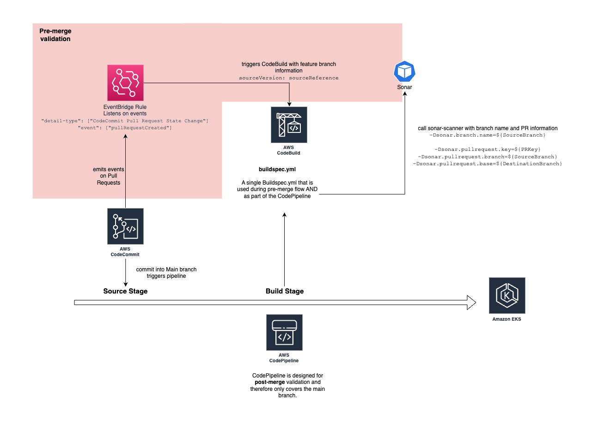

## Clean Code with AWS and Sonar CloudFormation plugin

This CloudFormation template simplifies the integration of SonarQube or SonarCloud with AWS CodeBuild and AWS CodePipeline.

In the spirit of "shift-left" we want to run code analysis as early as possible in the development workflow. This entails triggering Sonar code analysis not only on AWS CodePipeline builds of the `main` branch but also when Pull Requests (PR) are created or updated (typically after a round of reviews).
For this purpose, this plugin leverages [Amazon EventBridge](https://aws.amazon.com/eventbridge/). When you deploy the CloudFormation stack, an EventBridge rule will be deployed to your account that listens for Pull Requests (PR) of a predefined AWS CodeCommit repository. Once a PR is created or updated, it triggers your AWS CodeBuild build job which starts a [Sonar Pull Request Analysis](https://docs.sonarcloud.io/improving/pull-request-analysis/).

### Is this plugin useful for me?

1. Do you want to leverage SonarQube or SonarCloud's analysis feature from within your CI/CD workflow on AWS including Sonar's Pull Request analysis?
2. Do you use AWS CodeCommit, AWS CodePipeline and AWS CodeBuild as part of your CI/CD process?

If you can answer these questions with "yes", this is the right plugin for your use case.

### How to deploy the template?

You simply deploy the [CloudFormation template](./clean-code-sonar-aws-plugin.json) in this repository to your account in the same region as your CI/CD infrastructure is deployed to.

You will need to provide the `CodeCommitRepositoryARN` - the EventBridg rule will listen for PR's on this repository. You will also need to provide the ARN of your CodeBuild project that triggers Sonar (`SonarCodeBuildProjectARN`).

#### Environment variables used in the build process
The EventBridge rule will trigger the provided CodeBuild project, overriding the following environment variables:

`SOURCE_BRANCH`: The name of the branch the PR was created from.  
`DESTINATION_BRANCH`: The name of the branch the PR wants to be merged into.  
`PR_KEY`: A unique identifier for this PR  

Make sure you use all 3 values to invoke Sonar.

Check out this sample [`buildspec.yaml`](./buildspec.yml#L46) for a Java project to understand how Sonar is invoked from AWS CodeBuild.

#### Step-by-step instructions - Clean Code Workshop
For step-by-step instructions, on how retrieve the `Arn` values of your AWS CodeCommit and AWS CodeBuild projects, and how to deploy the CloudFormation template check [this page](https://catalog.workshops.aws/clean-code/en-US/cicd-pipeline/aws-sonar-plugin#deploy-cloudformation-template).

If you're interested in step-by-step instructions for a complete CI/CD pipeline on AWS, using AWS CodePipeline, AWS Codebuild and Sonar, then check out the [Clean Code with Sonar on AWS workshop](https://catalog.workshops.aws/clean-code/en-US).

## Cost

The Amazon EventBridge rule deployed as part of the CloudFormation template, will not incur any cost because all state change events published by AWS services by default are free and EventBridge rules are free as well. See [Amazon EventBridge pricing](https://aws.amazon.com/eventbridge/pricing/).

Your build jobs, pipelines, repositories, logging components and other resources will continue to incur cost as usual.

## Security

See [CONTRIBUTING](CONTRIBUTING.md#security-issue-notifications) for more information.

## License

This library is licensed under the MIT-0 License. See the LICENSE file.

